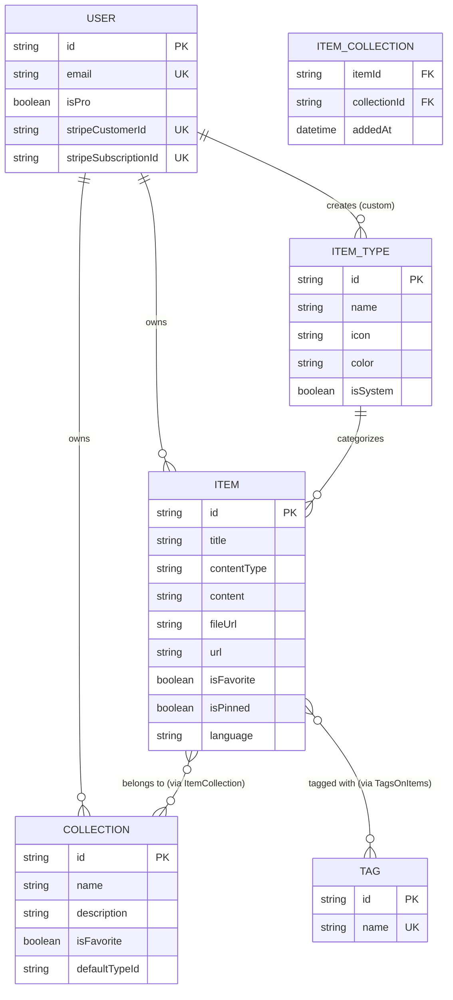
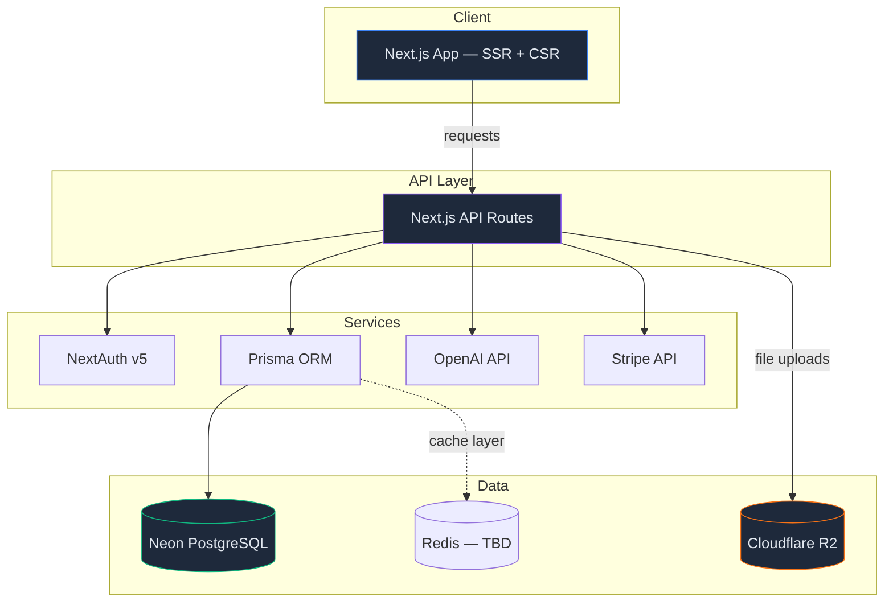
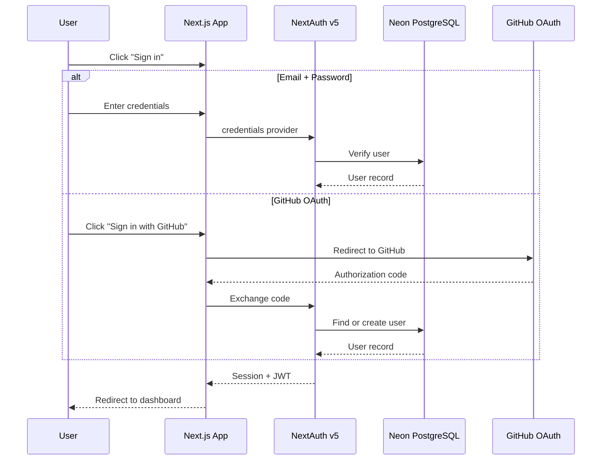

# DevStash — Developer Knowledge Hub

> One fast, searchable, AI-enhanced hub for all your dev knowledge & resources.

---

## Table of Contents

- [Problem](#problem)
- [Target Users](#target-users)
- [Features](#features)
- [Data Model (Draft)](#data-model-draft)
- [Entity Relationship Diagram](#entity-relationship-diagram)
- [Item Types Reference](#item-types-reference)
- [Tech Stack](#tech-stack)
- [Architecture Overview](#architecture-overview)
- [Authentication Flow](#authentication-flow)
- [Monetization](#monetization)
- [UI / UX Guidelines](#ui--ux-guidelines)
- [Useful Links & Resources](#useful-links--resources)

---

## Problem

Developers keep their essentials scattered across too many surfaces:

| What              | Where it ends up              |
| ----------------- | ----------------------------- |
| Code snippets     | VS Code, Notion, Gists        |
| AI prompts        | Chat histories                |
| Context files     | Buried in project directories |
| Useful links      | Browser bookmarks             |
| Docs & notes      | Random folders                |
| Terminal commands | `.bash_history`, `.txt` files |
| Project templates | GitHub Gists                  |

This causes constant context switching, lost knowledge, and inconsistent workflows. **DevStash** consolidates everything into a single, fast, searchable, AI-enhanced hub.

---

## Target Users

| Persona                        | Core Need                                               |
| ------------------------------ | ------------------------------------------------------- |
| **Everyday Developer**         | Quick access to snippets, prompts, commands, and links  |
| **AI-first Developer**         | Store prompts, contexts, workflows, and system messages |
| **Content Creator / Educator** | Organize code blocks, explanations, and course notes    |
| **Full-stack Builder**         | Collect patterns, boilerplates, and API examples        |

---

## Features

### A. Items & Item Types

Items are the core unit in DevStash. Each item has a **type** that determines its behavior. Users start with system-defined types (non-editable); custom types will come later as a Pro feature.

| Type    | Content Model | Icon         | Color                     | Route                       |
| ------- | ------------- | ------------ | ------------------------- | --------------------------- |
| Snippet | `text`        | `Code`       | 🔵 `#3b82f6` (Blue)       | `/dashboard/items/snippets` |
| Prompt  | `text`        | `Sparkles`   | 🟣 `#8b5cf6` (Purple)     | `/dashboard/items/prompts`  |
| Command | `text`        | `Terminal`   | 🟠 `#f97316` (Orange)     | `/dashboard/items/commands` |
| Note    | `text`        | `StickyNote` | 🟡 `#fde047` (Yellow)     | `/dashboard/items/notes`    |
| File    | `file`        | `File`       | ⚪ `#6b7280` (Gray) — Pro | `/dashboard/items/files`    |
| Image   | `file`        | `Image`      | 🩷 `#ec4899` (Pink) — Pro | `/dashboard/items/images`   |
| Link    | `url`         | `Link`       | 🟢 `#10b981` (Emerald)    | `/dashboard/items/links`    |

Items should be quick to access and create via a slide-out drawer.

### B. Collections

Users can organize items into named collections. An item can belong to multiple collections (many-to-many). Examples:

- **React Patterns** — snippets, notes
- **Context Files** — files
- **Interview Prep** — snippets, prompts
- **Python Snippets** — snippets

### C. Search

Full search across content, tags, titles, and types.

### D. Authentication

- Email + password sign-in
- GitHub OAuth

### E. Core Features

- Favorite collections and items
- Pin items to top
- Recently used items
- Import code from a file
- Markdown editor for text-based types
- File upload for file/image types
- Export data (JSON / ZIP — Pro only)
- Dark mode by default, light mode optional
- Add/remove items to/from multiple collections
- View which collections an item belongs to

### F. AI Features (Pro Only)

- AI auto-tag suggestions
- AI code summaries
- AI "Explain This Code"
- Prompt optimizer

---

## Data Model (Draft)

> ⚠️ **Draft** — This Prisma schema is a starting point and will evolve. Never use `db push` directly; always create and run migrations.

```prisma
// schema.prisma (DRAFT — subject to change)

generator client {
  provider = "prisma-client-js"
}

datasource db {
  provider = "postgresql"
  url      = env("DATABASE_URL")
}

// ─── User ──────────────────────────────────────────────
// Extends NextAuth's default User model.

model User {
  id                   String    @id @default(cuid())
  name                 String?
  email                String?   @unique
  emailVerified        DateTime?
  image                String?
  isPro                Boolean   @default(false)
  stripeCustomerId     String?   @unique
  stripeSubscriptionId String?   @unique

  accounts    Account[]
  sessions    Session[]
  items       Item[]
  collections Collection[]
  itemTypes   ItemType[]

  createdAt DateTime @default(now())
  updatedAt DateTime @updatedAt
}

// NextAuth required models (Account, Session, VerificationToken)
// omitted for brevity — generate with `npx prisma init --with-auth`

model Account {
  id                String  @id @default(cuid())
  userId            String
  type              String
  provider          String
  providerAccountId String
  refresh_token     String?
  access_token      String?
  expires_at        Int?
  token_type        String?
  scope             String?
  id_token          String?
  session_state     String?

  user User @relation(fields: [userId], references: [id], onDelete: Cascade)

  @@unique([provider, providerAccountId])
}

model Session {
  id           String   @id @default(cuid())
  sessionToken String   @unique
  userId       String
  expires      DateTime

  user User @relation(fields: [userId], references: [id], onDelete: Cascade)
}

model VerificationToken {
  identifier String
  token      String   @unique
  expires    DateTime

  @@unique([identifier, token])
}

// ─── Item Type ─────────────────────────────────────────

model ItemType {
  id       String  @id @default(cuid())
  name     String                        // e.g. "snippet", "prompt"
  icon     String                        // Lucide icon name
  color    String                        // Hex color code
  isSystem Boolean @default(false)       // true = built-in, non-editable

  userId String?                         // null for system types
  user   User?   @relation(fields: [userId], references: [id], onDelete: Cascade)

  items Item[]

  @@unique([name, userId])               // unique type name per user (+ system)
}

// ─── Item ──────────────────────────────────────────────

model Item {
  id          String  @id @default(cuid())
  title       String
  contentType String                     // "text" | "file" | "url"
  content     String?                    // text content (null if file)
  fileUrl     String?                    // Cloudflare R2 URL (null if text)
  fileName    String?                    // original filename
  fileSize    Int?                       // bytes
  url         String?                    // for link types
  description String?
  language    String?                    // programming language (optional)
  isFavorite  Boolean @default(false)
  isPinned    Boolean @default(false)

  userId     String
  user       User     @relation(fields: [userId], references: [id], onDelete: Cascade)

  itemTypeId String
  itemType   ItemType @relation(fields: [itemTypeId], references: [id])

  tags        TagsOnItems[]
  collections ItemCollection[]

  createdAt DateTime @default(now())
  updatedAt DateTime @updatedAt

  @@index([userId])
  @@index([itemTypeId])
}

// ─── Collection ────────────────────────────────────────

model Collection {
  id            String  @id @default(cuid())
  name          String                   // e.g. "React Hooks"
  description   String?
  isFavorite    Boolean @default(false)
  defaultTypeId String?                  // default ItemType for new items

  userId String
  user   User   @relation(fields: [userId], references: [id], onDelete: Cascade)

  items ItemCollection[]

  createdAt DateTime @default(now())
  updatedAt DateTime @updatedAt

  @@index([userId])
}

// ─── Item ↔ Collection (many-to-many) ──────────────────

model ItemCollection {
  itemId       String
  collectionId String
  addedAt      DateTime @default(now())

  item       Item       @relation(fields: [itemId], references: [id], onDelete: Cascade)
  collection Collection @relation(fields: [collectionId], references: [id], onDelete: Cascade)

  @@id([itemId, collectionId])
}

// ─── Tag ───────────────────────────────────────────────

model Tag {
  id   String @id @default(cuid())
  name String @unique

  items TagsOnItems[]
}

model TagsOnItems {
  itemId String
  tagId  String

  item Item @relation(fields: [itemId], references: [id], onDelete: Cascade)
  tag  Tag  @relation(fields: [tagId], references: [id], onDelete: Cascade)

  @@id([itemId, tagId])
}
```

---

## Entity Relationship Diagram



---

## Item Types Reference

```
┌──────────┬─────────────┬───────────┬─────────────┬────────────┐
│  Type    │ Content     │ Icon      │ Color       │ Tier       │
├──────────┼─────────────┼───────────┼─────────────┼────────────┤
│ Snippet  │ text        │ Code      │ #3b82f6     │ Free       │
│ Prompt   │ text        │ Sparkles  │ #8b5cf6     │ Free       │
│ Command  │ text        │ Terminal  │ #f97316     │ Free       │
│ Note     │ text        │ StickyNote│ #fde047     │ Free       │
│ Link     │ url         │ Link      │ #10b981     │ Free       │
│ File     │ file        │ File      │ #6b7280     │ Pro        │
│ Image    │ file        │ Image     │ #ec4899     │ Pro        │
└──────────┴─────────────┴───────────┴─────────────┴────────────┘
```

All icons sourced from [Lucide Icons](https://lucide.dev/icons/).

---

## Tech Stack

| Layer            | Technology                                  | Links                                                                                         |
| ---------------- | ------------------------------------------- | --------------------------------------------------------------------------------------------- |
| **Framework**    | Next.js 16 / React 19 (SSR + API routes)    | [nextjs.org](https://nextjs.org/docs)                                                         |
| **Language**     | TypeScript                                  | [typescriptlang.org](https://www.typescriptlang.org/docs/)                                    |
| **Database**     | Neon (Serverless PostgreSQL)                | [neon.tech](https://neon.tech/docs)                                                           |
| **ORM**          | Prisma 7 (latest)                           | [prisma.io](https://www.prisma.io/docs)                                                       |
| **Caching**      | Redis (TBD)                                 | [redis.io](https://redis.io/docs/)                                                            |
| **File Storage** | Cloudflare R2                               | [developers.cloudflare.com/r2](https://developers.cloudflare.com/r2/)                         |
| **Auth**         | NextAuth v5 (email/password + GitHub OAuth) | [authjs.dev](https://authjs.dev/getting-started)                                              |
| **AI**           | OpenAI `gpt-5-nano`                         | [platform.openai.com](https://platform.openai.com/docs)                                       |
| **Styling**      | Tailwind CSS v4 + shadcn/ui                 | [tailwindcss.com](https://tailwindcss.com/docs) / [ui.shadcn.com](https://ui.shadcn.com/docs) |
| **Payments**     | Stripe (subscriptions)                      | [stripe.com/docs](https://docs.stripe.com/)                                                   |
| **Icons**        | Lucide React                                | [lucide.dev](https://lucide.dev/icons/)                                                       |

> **Important:** Never use `db push` or directly update the database structure. Always create Prisma migrations that are run in dev first, then in production.

---

## Architecture Overview



---

## Authentication Flow



---

## Monetization

### Free Tier

- 50 items total
- 3 collections
- All system types **except** File and Image
- Basic search
- No file/image uploads
- No AI features

### Pro Tier — $8/month or $72/year

- Unlimited items and collections
- File & Image uploads (Cloudflare R2)
- Custom types (future)
- AI auto-tagging
- AI code explanation
- AI prompt optimizer
- Export data (JSON / ZIP)
- Priority support

> **Dev note:** During development, all users have full Pro access. The Pro gate will be enforced before launch.

---

## UI / UX Guidelines

### General Principles

- Modern, minimal, developer-focused aesthetic
- Dark mode by default; light mode optional
- Clean typography with generous whitespace
- Subtle borders and shadows
- Syntax highlighting for all code blocks
- **Design references:** [Notion](https://notion.so), [Linear](https://linear.app), [Raycast](https://raycast.com)

### Screenshots

Refer to the screenshots below as a base for the dashboard UI. It does not have to be exact. Use it as a reference

- @context\screenshots\devstash-dashboard.png
- @context\screenshots\devstash-drawer.png

### Layout

```
┌──────────────────────────────────────────────────────┐
│  ┌─────────┐  ┌──────────────────────────────────┐   │
│  │         │  │                                  │   │
│  │ Sidebar │  │         Main Content             │   │
│  │         │  │                                  │   │
│  │ • Types │  │  Collection cards (color-coded   │   │
│  │   list  │  │  by dominant item type)          │   │
│  │         │  │                                  │   │
│  │ • Recent│  │  Item cards (color-coded border) │   │
│  │  colls  │  │                                  │   │
│  │         │  │              ┌──────────────────┐ │   │
│  │         │  │              │  Item Drawer     │ │   │
│  │         │  │              │  (slide-out)     │ │   │
│  │         │  │              └──────────────────┘ │   │
│  └─────────┘  └──────────────────────────────────┘   │
└──────────────────────────────────────────────────────┘
```

- **Sidebar** — collapsible; item type nav links + recent collections. Becomes a drawer on mobile.
- **Main** — grid of collection cards (background tinted by dominant type color) and item cards (border color by type).
- **Drawer** — items open in a quick-access slide-out panel for viewing and editing.

### Micro-interactions

- Smooth transitions on all state changes
- Hover states on cards
- Toast notifications for actions (save, delete, copy)
- Loading skeletons during data fetches

### Responsive

- Desktop-first design
- Mobile-usable with sidebar → drawer conversion

---

## Useful Links & Resources

| Resource                 | URL                                                    |
| ------------------------ | ------------------------------------------------------ |
| Next.js 16 Docs          | https://nextjs.org/docs                                |
| React 19 Docs            | https://react.dev                                      |
| Prisma Docs              | https://www.prisma.io/docs                             |
| Neon Serverless Postgres | https://neon.tech/docs                                 |
| NextAuth v5 (Auth.js)    | https://authjs.dev                                     |
| Tailwind CSS v4          | https://tailwindcss.com/docs                           |
| shadcn/ui Components     | https://ui.shadcn.com/docs                             |
| Lucide Icons             | https://lucide.dev/icons/                              |
| Cloudflare R2            | https://developers.cloudflare.com/r2/                  |
| Stripe Subscriptions     | https://docs.stripe.com/billing/subscriptions/overview |
| OpenAI API               | https://platform.openai.com/docs                       |

---

_Last updated: March 2026_
